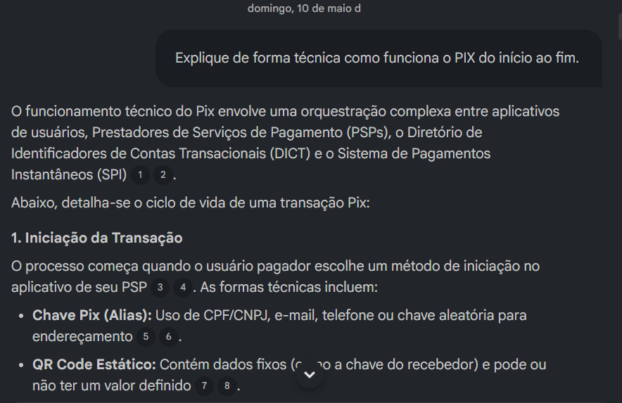
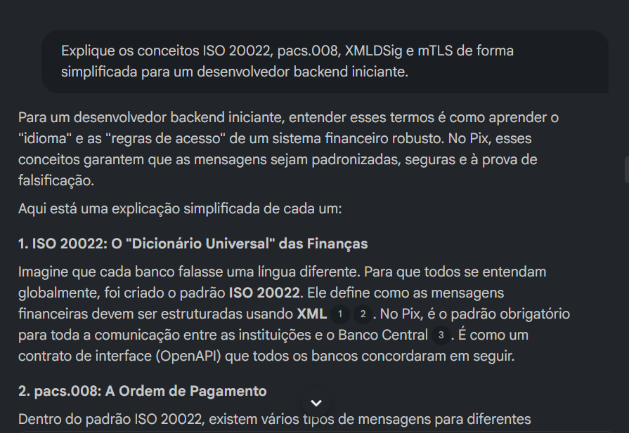
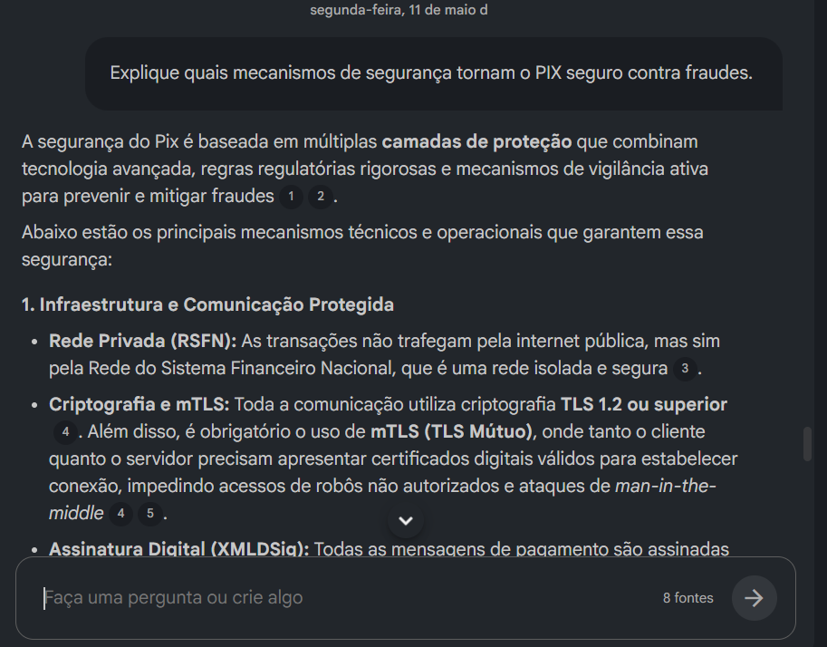

# pix-bastidores-notebooklm

Pix - Bastidores, Segurança e Arquitetura Financeira

Projeto desenvolvido utilizando NOtebookLM e GitHub para desafio da DIO.

## Sobre o Projeto:

Este projeto foi desenvolvido como parte do desafio prático da DIO utilizando o NotebookLM como ferramenta de aprendizagem ativa e organização de conhecimento.

O tema escolhido foi o funcionamento técnico do PIX, com foco em segurança, comunicação entre instituições financeiras, mecanismos antifraude e arquitetura tecnológica utilizada pelo Banco Central.

Durante o desenvolvimento do projeto, foram utilizados prompts estratégicos para explorar conceitos técnicos relacionados a sistemas financeiros modernos, permitindo consolidar conhecimentos sobre mensageria bancária, autenticação, criptografia e liquidação instantânea de pagamentos.

## Objetivos:

- Entender o funcionamento técnico do PIX;
- Compreender o papel do Banco Central no sistema de pagamentos instantâneos;
- Estudar mecanismos de segurança utilizados em transações financeiras;
- Aprender conceitos relacionados a APIs, autenticação e criptografia;
- Explorar padrões de comunicação financeira como ISO 20022;
- Utilizar IA como ferramenta de apoio ao aprendizado técnico;
- Desenvolver habilidades de engenharia de prompts e documentação técnica.

## Fontes Utilizadas:

Banco Central do Brasil - PIX https://www.bcb.gov.br/estabilidadefinanceira/pix

Banco Central do Brasil - Segurança no Pix
https://www.bcb.gov.br/estabilidadefinanceira/pix-seguranca

FastAPI Docs
https://fastapi.tiangolo.com/

JWT Introdução
https://www.jwt.io/introduction#what-is-json-web-token

Manual_de_Seguranca.pdf

II_ManualdePadroesparaIniciacaodoPix.pdf

IV_RequisitosMinimosparaExperienciadoUsuario.pdf

IX_ManualdeTemposdoPix.pdf

## Engenharia de Prompt:

Prompt 1 - Funcionamento técnico do PIX

"Explique de forma técnica como funciona o PIX do começo ao fim."

Resposta obtida:

O NotebookLM explicou que o funcionamento do PIX depende da integração entre:

aplicativos bancários;
instituições financeiras (PSPs);
DICT (Diretório de Identificadores de Contas Transacionais);
SPI (Sistema de Pagamentos Instantâneos).

A resposta detalhou o fluxo completo da transação:

1. Iniciação

O usuário pode iniciar um PIX através de:

chave PIX;
QR Code estático;
QR Code dinâmico;
aproximação NFC;
inserção manual de dados bancários.
2. Segurança e Validação

O sistema realiza:

autenticação do usuário;
consulta ao DICT;
análise antifraude;
verificação de limites.
3. Liquidação Financeira

A comunicação entre bancos ocorre utilizando:

padrão ISO 20022;
criptografia TLS;
mensagens pacs.008 e pacs.002.

O SPI realiza a liquidação instantânea diretamente no Banco Central.

4. Conclusão

Após a liquidação:

o recebedor recebe o valor;
os usuários são notificados;
o sistema gera identificadores únicos da transação.
Aprendizados Obtidos

Durante esta interação foi possível compreender:

o papel do Banco Central no PIX;
como ocorre a liquidação instantânea;
o funcionamento do SPI e DICT;
a importância de criptografia e autenticação;
como APIs e mensageria financeira funcionam.
Dificuldades Encontradas

A resposta apresentou muitos termos técnicos avançados, como:

ISO 20022;
XMLDSig;
pacs.008;
mTLS.

Foi necessário realizar perguntas complementares para entender melhor esses conceitos.

Prompt 2 - Explicação simplificada de termos técnicos

"Explique os conceitos ISO 20022, pacs.008, XMLDSig e mTLS de forma simplificada para um desenvolvedor backend iniciante."

Resultado do Prompt Refinado:

O NotebookLM explicou conceitos técnicos utilizados no ecossistema do PIX de forma simplificada para desenvolvedores backend.

ISO 20022

Foi apresentado como o padrão universal de comunicação financeira utilizado entre bancos e o Banco Central.

O modelo foi comparado a um contrato de interface, semelhante a uma especificação de API, definindo como as mensagens financeiras devem ser estruturadas.

pacs.008

A resposta explicou que a mensagem pacs.008 representa a ordem de pagamento utilizada no PIX.

Ela contém:

valor da transação;
identificador da operação;
dados do pagador;
dados do recebedor.
XMLDSig

O NotebookLM explicou que o XMLDSig funciona como uma assinatura digital aplicada às mensagens XML.

Seu objetivo é garantir:

integridade da mensagem;
autenticação;
impossibilidade de adulteração da transação.
mTLS

Foi explicado que o mTLS realiza autenticação mútua entre instituições financeiras e Banco Central.

Diferente do HTTPS tradicional, ambas as partes precisam comprovar identidade através de certificados digitais.

Conhecimentos Técnicos Aprendidos

Durante este refinamento foi possível compreender:

padrões de mensageria financeira;
autenticação entre sistemas bancários;
segurança de APIs financeiras;
funcionamento de assinaturas digitais;
arquitetura de comunicação do PIX.
Insight Obtido

O estudo demonstrou que o PIX não funciona apenas como uma transferência instantânea simples, mas como um ecossistema altamente estruturado, com:

protocolos de segurança;
mensageria padronizada;
autenticação robusta;
liquidação em tempo real.

Prompt 3 — Segurança e Prevenção de Fraudes no PIX

#Prompt sugerido:

"Explique quais mecanismos de segurança tornam o PIX seguro contra fraudes."

Resposta Obtida

O NotebookLM explicou que o PIX utiliza múltiplas camadas de segurança para prevenir fraudes e proteger transações financeiras.

Os principais mecanismos identificados foram:

Infraestrutura Segura
utilização da RSFN (Rede do Sistema Financeiro Nacional);
comunicação criptografada via TLS 1.2+;
autenticação mútua com mTLS;
assinatura digital XMLDSig.
Controle e Monitoramento
limitação de consultas ao DICT;
marcação de contas suspeitas de fraude;
compartilhamento de alertas entre instituições financeiras.
Vigilância Ativa
retenção temporária de transações suspeitas;
bloqueio cautelar de valores;
controle de dispositivos não cadastrados;
limites operacionais configuráveis.
Recuperação de Valores
utilização do MED (Mecanismo Especial de Devolução);
possibilidade de contestação de fraudes;
análise interbancária para devolução de recursos.
Aprendizados Obtidos

Foi possível compreender que a segurança do PIX vai além da criptografia tradicional, envolvendo:

monitoramento comportamental;
validação de identidade;
análise de risco;
integração entre instituições financeiras;
mecanismos de resposta a fraudes.
Insight Obtido

O estudo mostrou que o PIX foi projetado como uma infraestrutura financeira de alta disponibilidade e alta segurança, combinando:

protocolos criptográficos;
validação institucional;
monitoramento contínuo;
mecanismos regulatórios do Banco Central.

## Glossário

Termo - Definição 

PIX: Sistema de pagamentos instantâneos do Banco Central
SPI: Sistema de Pagamentos Instantâneos
DICT: Diretório de Identificadores de Contas Transacionais
ISO 20022: Padrão internacional de mensagens financeiras
pacs.008: Mensagem financeira de ordem de pagamento
XMLDSig: Assinatura digital para mensagens XML
mTLS: Autenticação mútua via certificados digitais
MED: Mecanismo Especial de Devolução
RSFN: Rede do Sistema Financeiro Nacional

## Conclusão

O desenvolvimento deste caderno temático permitiu compreender que o PIX envolve uma arquitetura tecnológica altamente sofisticada, muito além de uma simples transferência instantânea.

O estudo demonstrou como conceitos de:
- segurança;
- mensageria financeira;
- autenticação;
- criptografia;
- liquidação bancária;
- comunicação entre sistemas

são fundamentais para o funcionamento do sistema financeiro moderno.

Além disso, o projeto evidenciou como ferramentas de IA, como o NotebookLM, podem auxiliar na organização do conhecimento, refinamento de estudos técnicos e desenvolvimento de pensamento crítico.

Capturas do Projeto

Prompt Inicial

Prompt Técnico

Segurança Anti-Fraudde

